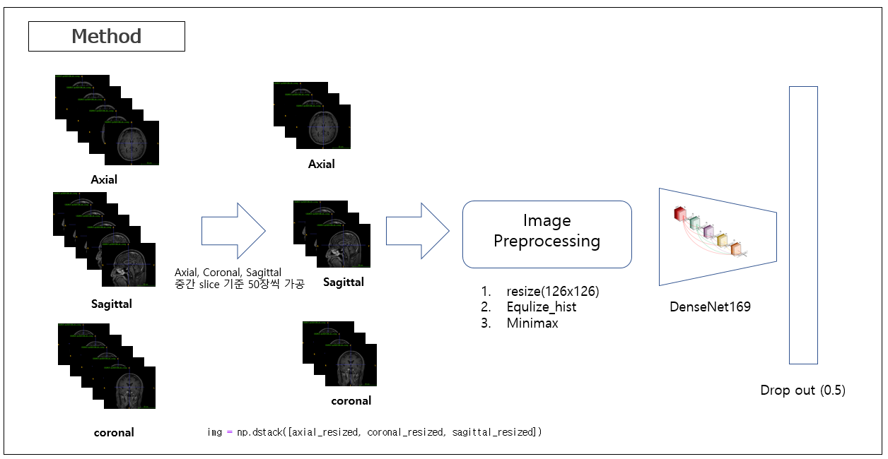

# MRI Modality (t1ce, bb, others) Classification

The MRI Modality Classification model housed in this repository is adept at categorizing MRI images into T1-weighted post-contrast (T1ce), Black Blood (BB), and various other sequences. This model meticulously processes scans along the axial, sagittal, and coronal planes to capture a complete range of spatial detail in cerebral imaging. Training for this model is fortified by a dataset comprising patient data from Asan Medical Center (272 patients) and Seoul National University Bundang Hospital (543 patients), enriching its learning capacity and accuracy in clinical diagnostics.

## **Model Architecture**

<p align="center">
    
</p>


The architecture is built on the DenseNet169 convolutional neural network framework, known for its dense connectivity pattern between layers which promotes feature reuse and reduces the number of parameters, making the network efficient and powerful for image classification tasks.

### **Input** 
MRI Images: The input to the model includes MRI scans in axial, sagittal, and coronal planes, providing a comprehensive view of the brain's anatom


### **Preprocessing** 
* Resize: All images are resized to 126x126 pixels to maintain uniformity across the dataset.
* Histogram Equalization (Equalize_hist): This step enhances the image contrast, allowing for better feature detection by the model.
* Normalization (Minimax): Pixel values are scaled to a standard range to improve model sensitivity and training efficiency.

### **Regularization**
* Dropout (0.5): A dropout rate of 50% during training helps in preventing overfitting and encourages the development of a more robust model.

## **Requirements**
* tensorflow 2.0.0
* matplotlib 3.3.4
* SimpleITK 1.2.4
```python
%cd Test
!pip install -r 'requirements.txt'
```


## **How can we use ?**
- The example code below applies to almost all modules.
  
### **Inference**
```python
%cd Test
!python run_main.py -i './input_data' -gpu -1
```                 
* i: Input cxr image folder location.
* gpu: Please enter the gpu number you will use
  
The output results are saved as a csv file in the location corresponding to parameter i.

## **Contributing**

If you'd like to contribute, or have any suggestions for these guidelines, you can contact us at junegoo.lee@gmail.com or open an issue on this GitHub repository.

